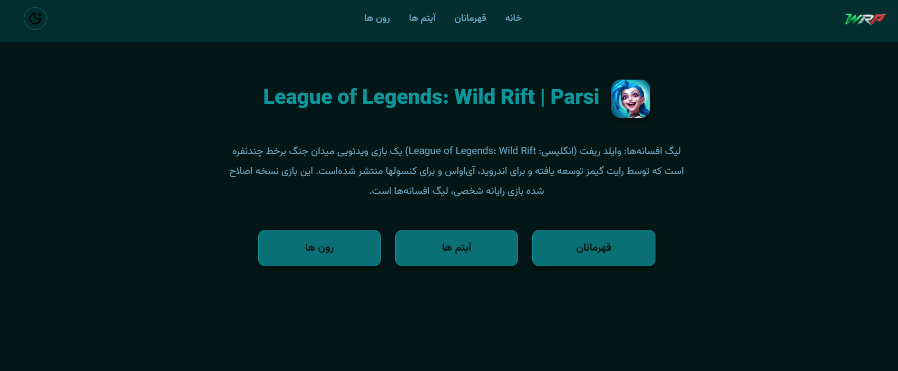
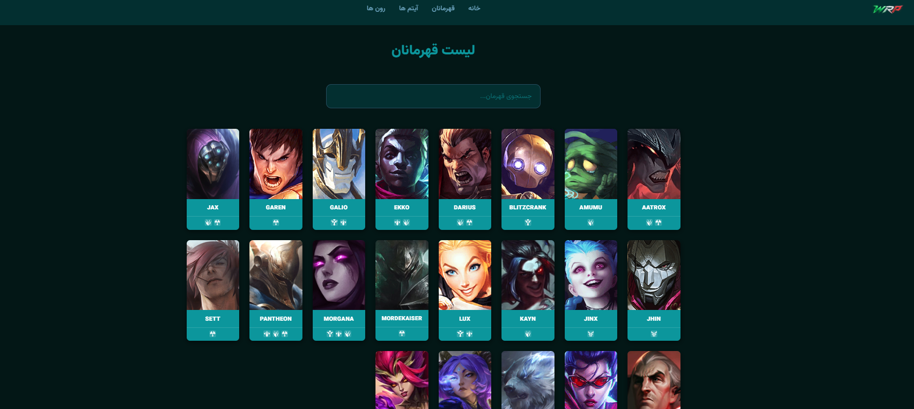
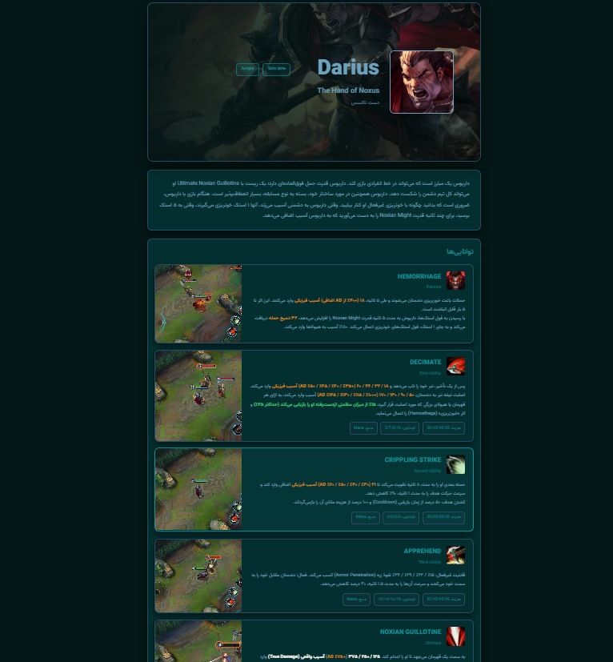
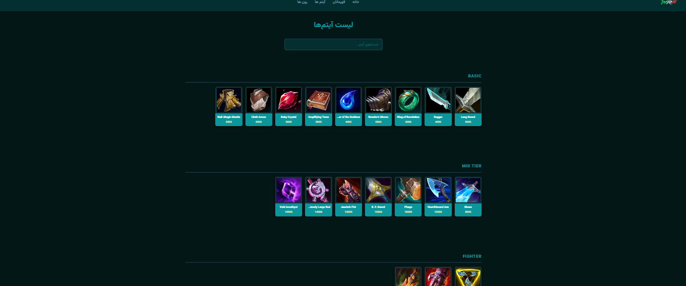
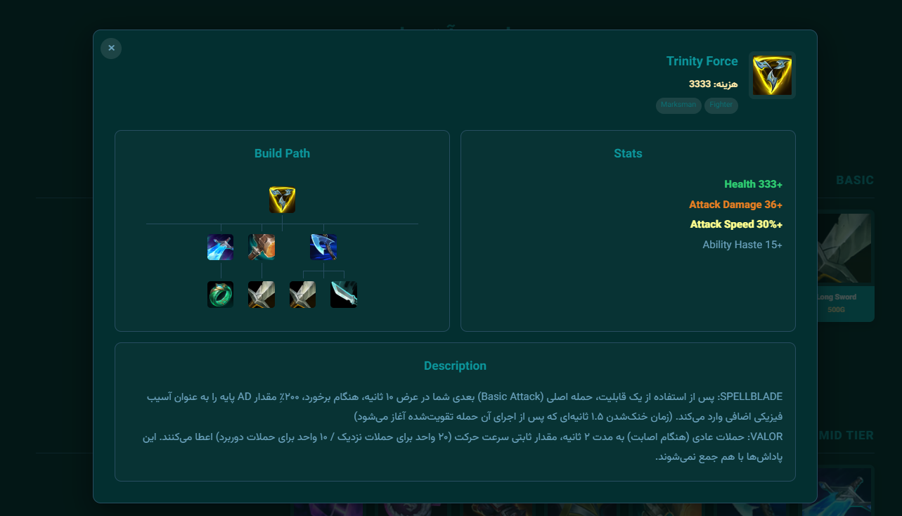

# WRPARSI
# a guide and introductory site for the game LoL: Wild Rift.

اولین پروژه جنگو برای تجربه با هدف آشنایی عملی بیشتر با توسعه وب و ساخت یک پروژه واقعی بدون کمک منابع آموزشی صورت گرفته است.
( البته بخش فرانت اِند front-end
 با کمک ابزار های هوش مصنوعی تکمیل شده. )

هدف از ساخت این سایت معرفی بازی lol wildrift 
در سبک moba است
در آن به معرفی قهرمانان بازی، آیتم ها، رون ها و اسپل های بازی میپردازد


### ویژگی های سایت(features)

- معرفی قهرمانان {champions introduction}
- معرفی آیتم ها {items introduction}
- معرفی رون ها و اسپل ها {runes and spells introduction}
- بخش جستجو برای قهرمانان و آیتم ها {search section for champions and items}


### ابزار ها و تکنولوژی های مورد استفاده (technologies)

- Python
- Django
- SQLite
- HTML
- CSS
- HTMX
- Git

## screenshots

### Home Page


### Champions Page


### Champion Page


### Items Page


### Item Page



### Installation(نحوه نصب)

```bash
git clone https://github.com/AKILLERHM/WRPARSI.git
cd WRPARSI

python -m venv .WRPvenv

#windows
.WRPvenv/Scripts/activate

# Linux / macOS
source .WRPvenv/bin/activate

pip install -r requirements.txt

python manage.py migrate
python manage.py runserver
```\